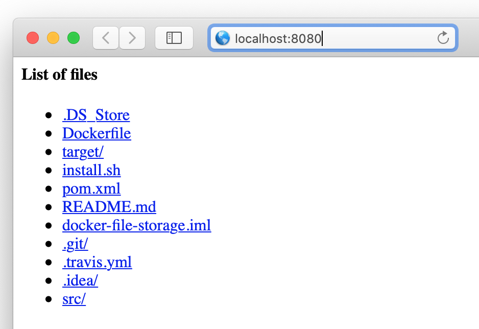

[](https://travis-ci.org/smpavlenko/docker-file-server)

# Docker File Server
##### HTTP web server in Java, using only the standard JDK

This repository

## Requirements
The server is delivered inside a Docker container
The server handles HTTP GET and HEAD requests. Other requests handling is not implemented
The server handles properly HTTP *ETag*, *If-Match*, *If-Non-Match*, *If-Modified-Since* headers 

## Architecture
HTTP web server in Java, using only the standard JDK without using existing HTTP server frameworks. The server serves static files and directories from a user-specified root directory. It also gives possibility to discover subdirectories.

## Prerequisites
To build, deploy and verify application you must have installed
* bash or shell console
* java version 11
* maven
* docker

## Repository Structure
```bash
.
├── README.md
├── Dockerfile
├── install.sh
├── pom.xml
├── .travis.yml
└── src
    ├── main
    │   ├── java
    │   │   ├── com.pavlenko.dto
    │   │   ├── com.pavlenko.processor
    │   │   ├── com.pavlenko.service
    │   │   ├── com.pavlenko.util
    │   │   │   
    │   │   ├── Application.java
    │   │   ├── Server.java
    │   │   └── Module.java
    │   └── resources
    │       ├── templates
    │       │   └── dir_template.html
    │       ├── 403_response.html
    │       ├── 404_response.html
    │       └── log4j2.xml
    │
    └── test
        └── java

```

**Application** main application, starting point of the server

**Server** Server implementation

**Module** instantiation of all necessary beans 

**templates/dir_template.html** html template for list files response

**403_response.html** HTML response for 403 HTTP code

**404_response.html** HTML response for 404 HTTP code

**log4j2.xml** log4j2 xml configuration

## Building and Deployment
To build java application, run in console 
```bash
mvn clean install
```

To build docker container, run in console 
```bash
docker build -t docker-file-server .
```
where *docker-file-server* is arbitrary name of container

To run docker container, run in console 
```bash
docker run -it --rm -p 8080:8080 -v $root_dir:/root_dir --name docker-file-server docker-file-server /root_dir
```
where *$root_dir* is user-specified root directory to observe, e.g.:
```bash
docker run -it --rm -p 8080:8080 -v $(pwd):/root_dir --name docker-file-server docker-file-server /root_dir
```

To build and deploy all at once, run
```bash
./install.sh
```

## Verification
To experience application working, type *localhost:8080* in web browser


To send HEAD requests or modify headers, use Postman or curl