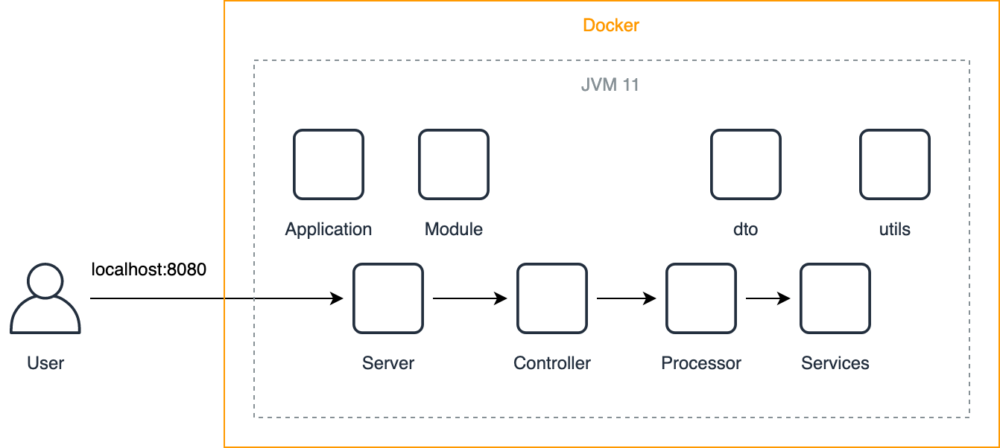

[](https://travis-ci.org/smpavlenko/docker-file-server)

# Docker File Server
##### HTTP web server in Java, using only the standard JDK

This repository contains code to build and deploy simple web server which allows to traverse through user defined directory using web client.

Main capabilities
* The server is implemented using java standard *HttpServer*, *HttpHandler*, *HttpExchange* classes from *com.sun.net.httpserver* package
* The server implementation is using *apache log4j*, *apache commons-codec*, *lombok* libraries
* The server writes logs to stdout console
* The server is delivered inside a Docker container
* The server handles HTTP GET and HEAD requests. Other requests handling is not implemented
* The server handles properly HTTP *ETag*, *If-Match*, *If-Non-Match*, *If-Modified-Since* headers according to HTTP standards 
* The server could properly handle *Keep-Alive* request headers and reuses established connection

## Architecture
HTTP web server in Java, using only the standard JDK without using existing HTTP server frameworks. The server serves static files and directories from a user-specified root directory. It also gives possibility to discover subdirectories.



## Prerequisites
To build, deploy and verify application you must have installed
* bash or shell console
* java version 11
* maven
* docker
* http client (web browser, Postman, curl)

## Repository Structure
```bash
.
├── README.md
├── Dockerfile
├── install.sh
├── pom.xml
├── .travis.yml
├── assets
└── src
    ├── main
    │   ├── java
    │   │   ├── com.pavlenko.controller
    │   │   ├── com.pavlenko.dto
    │   │   ├── com.pavlenko.processor
    │   │   ├── com.pavlenko.service
    │   │   ├── com.pavlenko.util
    │   │   │   
    │   │   ├── Application.java
    │   │   ├── Module.java
    │   │   └── Server.java
    │   └── resources
    │       ├── templates
    │       │   └── dir_template.html
    │       ├── 403_response.html
    │       ├── 404_response.html
    │       └── log4j2.xml
    │
    └── test
        └── java

```

**assets** dir with description images

**Application** main application, starting point of the server

**Server** Server implementation

**Module** instantiation of all necessary beans 

**templates/dir_template.html** html template for list files response

**403_response.html** HTML response for 403 HTTP code

**404_response.html** HTML response for 404 HTTP code

**log4j2.xml** log4j2 xml configuration

## Building, deployment and starting server
To build java application, run in console 
```bash
mvn clean install
```

To build docker container, run in console 
```bash
docker build -t docker-file-server .
```
where *docker-file-server* is arbitrary name of container

To run docker container, run in console 
```bash
docker run -it --rm -p 8080:8080 -v $root_dir:/root_dir --name docker-file-server docker-file-server /root_dir
```
where *$root_dir* is user-specified root directory to observe, e.g.:
```bash
docker run -it --rm -p 8080:8080 -v $(pwd):/root_dir --name docker-file-server docker-file-server /root_dir
```

To build and deploy all at once, run
```bash
./install.sh
```

Application logs will be written to console

## Verification
To experience application working, type *localhost:8080* in web browser


To send HEAD requests or modify *If-Match*, *If-Non-Match*, *If-Modified-Since* request headers, use Postman or curl
```bash
sergiipavlenko$ curl --head http://localhost:8080/README.md
HTTP/1.1 200 OK
date: Sat Aug 29 16:13:59 UTC 2020
content-length: 3463
ETag: "c258853ccf2c6c326f686595ea043d4f"
content-type: text/markdown
Last-Modified: Sat Aug 29 16:12:01 UTC 2020```
```

Example of POST(unsupported) request
```bash
sergiipavlenko$ curl -X POST --head http://localhost:8080/README.md
HTTP/1.1 403 Forbidden
Date: Sun, 30 Aug 2020 11:41:32 GMT
Content-type: text/html
Content-length: 206
```

Example of request with *If-Match* header
```bash
sergiipavlenko$ curl --head http://localhost:8080/README.md --header 'If-Match: "0f46357eafa5c719e8e3bf277a993e07"'
HTTP/1.1 304 Not Modified
date: Sat Aug 29 16:15:58 UTC 2020
content-length: 3471
ETag: "7f8fd1e2c0241d5cc979f678d09bef6a"
content-type: text/markdown
Last-Modified: Sat Aug 29 16:14:56 UTC 2020
```

Example of request with *If-Modified-Since* header
```bash
sergiipavlenko$ curl --head http://localhost:8080/README.md --header 'If-Modified-Since: Sun Aug 30 13:35:22 CEST 2050'
HTTP/1.1 304 Not Modified
Date: Sun, 30 Aug 2020 11:39:24 GMT
Last-modified: Sun Aug 30 13:35:22 CEST 2020
Content-type: text/plain
Etag: "81a2297758872229fda4882eb849f674"
Content-length: 4301
```
